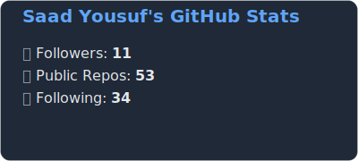

 

  
Hi  I am 

 

-----
<!--

-->

-----

Versatile Developer in | MERN Stack, Android, WordPress, Game Dev, Cybersecurity | Reactjs, Nodejs, Expressjs, Nextjs Kotlin, Java, Python, TypeScript, ML & AI. ᵕ̈

*   🌍  I'm based in Pakistan
*   🖥️  See my portfolio at [comingsoon](http://comingsoon)
*   ✉️  You can contact me at [get in touch](mailto:saadshaan619@gmail.com)
*   🚀  I'm currently working on [mySelf](https://github.com/bluekitsune-sad/mentalHealthAnalyzer)
*   🧠  I'm learning how to live
*   🤝  I'm open to collaborating on web applicaion based on react and android applications
*   ⚡  @-@
*   [battle in css](https://cssbattle.dev/)

<h2>  Skills</h2> 
  

    <h4>Core</h4>
    
    
    
    
    
    <h4>FrontEnd</h4>
    
    
<!--      -->
    <h4>Styling/Framworks</h4>
    
    
    
    
    
    <h4>Backend and Database</h4>
    
    
    
    
    
    
    
<!--     <h4>Others</h4> -->
    <h4>Software</h4>
    
    
    
    
    
    
    
    
    <h4>OperatingSystem</h4>
    
    
    <h4>Cloud</h4>
    
    

                    
<h2> 🤙🏻 Socials</h2> 

  
Contact Me
                
  
 
  <a href="https://www.github.com/bluekitsune-sad" target="_blank" rel="noreferrer"> <picture> <source media="(prefers-color-scheme: dark)" srcset="https://raw.githubusercontent.com/danielcranney/readme-generator/main/public/icons/socials/github-dark.svg" /> <source media="(prefers-color-scheme: light)" srcset="https://raw.githubusercontent.com/danielcranney/readme-generator/main/public/icons/socials/github.svg" />  </picture> </a> 
  <!--   
  </a> -->
  <a href="https://www.x.com/@sad_yosuf" target="_blank" rel="noreferrer"> <picture> <source media="(prefers-color-scheme: dark)" srcset="https://raw.githubusercontent.com/danielcranney/readme-generator/main/public/icons/socials/twitter-dark.svg" />       <source media="(prefers-color-scheme: light)" srcset="https://raw.githubusercontent.com/danielcranney/readme-generator/main/public/icons/socials/twitter.svg" />  </picture> 
  </a>
  

<b>My GitHub Stats</b>

<!--
 
-->

<!--
 
-->

<!--

-->

<!--

-->

<h2>😅 Joke of the day</h2>

    
See joke

    

<h2> ✍️ Random Dev Quote</h2> 

  
see Quote

  

<h2> 🐍 Snakesss:</h2> 

  
see The commits being eaten

  <picture>
    <source media="(prefers-color-scheme: dark)" srcset="https://raw.githubusercontent.com/bluekitsune-sad/Commit-Snake/output/github-contribution-grid-snake-dark.svg">
    <source media="(prefers-color-scheme: light)" srcset="https://raw.githubusercontent.com/bluekitsune-sad/Commit-Snake/output/github-contribution-grid-snake.svg">
    
  </picture>
  

<!--/media.giphy.com/media/WUlplcMpOCEmTGBtBW/giphy.gif-->
<!--🐱CAT-->

<!--

-->

